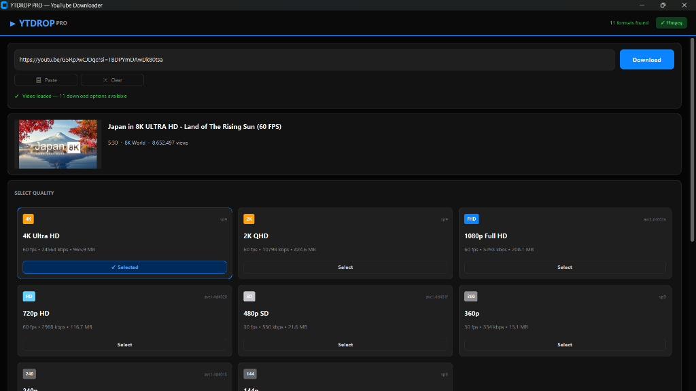
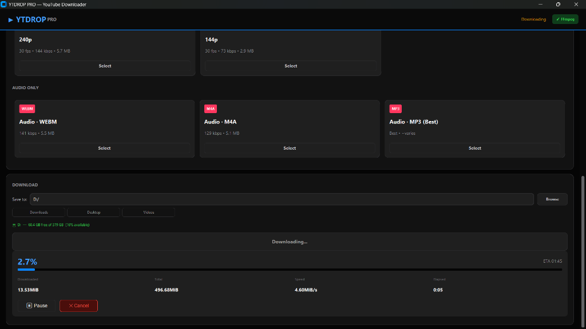
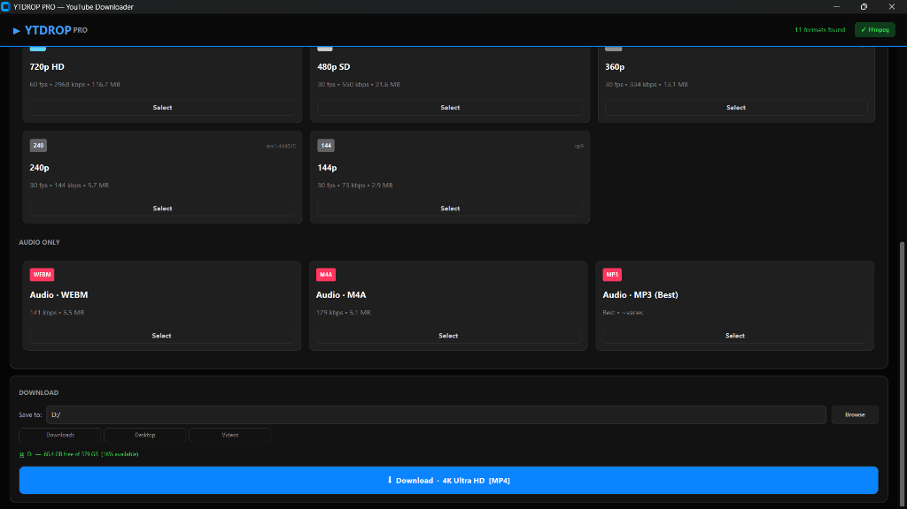
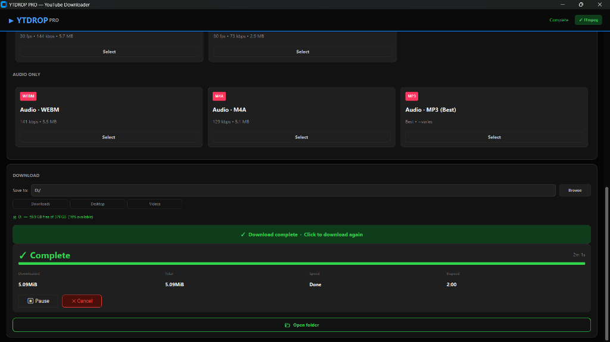

<div align="center">
  
  <br/>
  <h3>The Ultimate Cinematic YouTube Downloader</h3>
  <p>Fully overhauled using a premium macOS-inspired Obsidian Dark Theme with <code>customtkinter</code>.</p>
</div>

---


<br/>

**YTDROP PRO** is a remarkably aesthetic and high-performance video downloader tailored to power-users. Engineered with Python, wrapped in an elite Obsidian Cinematic UI, and powered seamlessly by `yt-dlp` and `FFmpeg`—this app lets you pull up to **8K resolutions** safely, fast, and drop-dead gorgeous.

## 🌟 UI Previews

See the beautifully orchestrated interface natively in action!

### Format Selection Layout
Complete structured data bridging 8K-to-144p videos with audio streams.  


### Active Stream Polling
Precision progress hook rendering exact fraction boundaries and live ETA estimates.  


### Instant Selection Confirmation
Premium highlighting and aesthetic Apple-Blue selections.  


### Execution & Directory Loading
A clean finalized prompt tracking elapsed speeds natively wrapping back to the user.  


---

## 🔥 Key Features

- 🍎 **Obsidian Cinematic Architecture**: Complete Dark-Mode UI transformation (`#050505` True Black) sporting Apple's System Blue interactive accents. 
- 🎛️ **Card-Based format Filtering**: A three-column interactive hover grid categorizing format qualities intelligently from standard lengths up to 8K Ultra HD. 
- ⏸️ **Instant Interruptions**: Native `Pause`, `Resume`, and `Cancel` buttons seamlessly integrated straight into the network sockets to freeze data without corrupting chunks!
- 🎯 **Micrometer Precision**: Forget inaccurate parsing—downloads hook directly into yt-dlp dictionary byte streams to deliver **Chrome-level exact fractional percentages (`0.0%`)**.
- 💽 **FFmpeg Harmonization**: Automatic detection and mapping of local FFmpeg resources to guarantee that video feeds safely merge with audio pipelines. (Zero loss of quality).

---

## 🚀 Quick Setup & Installation

**1. Install Core Dependencies**
YTDROP requires a few bleeding-edge packages to function. Open your terminal and run:
```bash
pip install customtkinter yt-dlp Pillow requests
```

**2. Deploy FFmpeg (Windows)**  
If you plan to merge high-resolution video streams (1080p, 1440p, 4K, 8K) with high-fidelity audio streams, you **must** have FFmpeg natively hooked or the terminal will fallback.
```bash
winget install ffmpeg
```
*Note: Restart your machine or terminal session immediately after installation.*

**3. Launch**  
```bash
python youtube_downloader.py
```

---

## 🎨 Technical Palette 

This project operates on a meticulously tuned color palette for an authentic premium look:
- **Core Background**: `#050505` (Obsidian Black)
- **Glass Surfaces**: `#121212` (Metal Slate Cards)
- **Interactions**: `#0a84ff` (Apple System Blue)
- **Success Prompts**: `#32d74b` (Brilliant Emerald)

---

### ©️ Disclaimer & Acknowledgements
- Powered by [yt-dlp](https://github.com/yt-dlp/yt-dlp) and beautifully rendered utilizing [customtkinter](https://github.com/TomSchimansky/CustomTkinter).
- **Note:** Always ensure you have the proper licenses to download files offline. 
